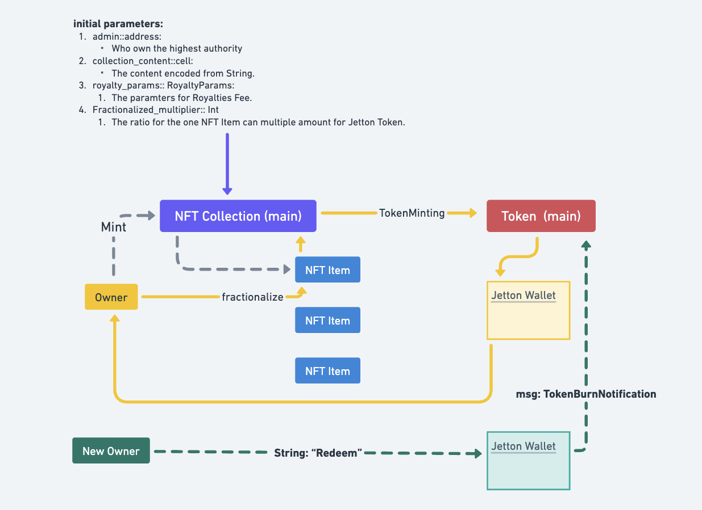
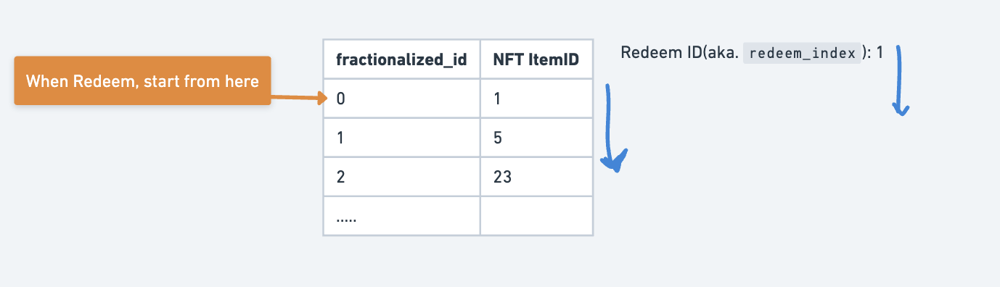

# Intro

This experimental implementation revolves around an "NFT Item" that can be locked or staked, and then fractionalized into a liquid asset.

The benefits of this approach are quite straightforward for "High-value" NFTs, as it allows anyone to invest in the NFT without having to acquire the entire item.

## A Few Questions Before We Start

1. Who decides the `Convert Rate`, and how is it decided? For example, should one NFT item be equivalent to 1:10,000 or 1:100 tokens?
2. What is the process for `locking/redeeming`, and how should we define it?
3. Will the original owner of the NFT take the risk that the NFT item may be redeemed by others?
4. Should the people redeeming the NFT pay the fee, even if they have enough liquid tokens to burn?
5. What can people do with the **Liquid Assets**? Should we design an LP (Liquidity Provider) reward system to encourage people to lock their NFTs to mint more liquid tokens?

# Protocol Structure



-   Pemission-less.
-   Easy-to-use.
-   No-brain, just mint NFT then locked it.

### Userflow

1. Deploy & Send the transaction to the Collection contract(with `Mint` text), to mint NFT Item.
2. Once own any NFT Item, then send the Transaction with text `f`(you can change it in Tact code if you want), then the NFT will in the `locked` status, and being minting as the fractionazlied Jetton Token.
3. You can send Jetton Token to do anything you want.
4. ANYONE can burn Jetton token to redeem the NFT Item.
5. The NFT Item being redeem is followed the record that based on `first-in-first-out` mechanism(based on the list in smart contract)



# Commend

This project using the best template [1](https://github.com/tact-lang/tact-template), [2](https://github.com/howardpen9/nft-template-in-tact/tree/tutorial/sources)

```bash
yarn build # To build contract
yarn test # To test contract
yarn deploy_0 # To deploy NFT Contract
yarn deploy_1 # To upload Jetton Contract Information
```

## Deployment

To deploy contract you should:

1. Specify `contract.tact` that will be used as entry point of your contract
2. Configure `contract.deploy.ts` according to your `contract.tact` to generate a deployment link. In particular, it is necessary to correctly call the Init() function from the contract.

If you renamed `contract.tact` to something else, you need to update `tact.config.json` correspondingly. For more information , see [Tact Documentation](https://docs.tact-lang.org/language/guides/config)

## Prepare — Parameters

1. Prepare the URL for NFT metadata; you can find example parameters in our `contract.deploy_nft.ts` to see what needs modification.
2. Paste the `admin` address in the `contract.deploy_nft.ts` to set the admin address. _NOTICE_: We haven't implemented the status for closing the minting of NFTs yet. We highly recommend you implement this later. Otherwise, there's an incentive for people to mint more NFTs and then redeem your NFT after they fractionalize the latest NFT.
3. Note that you can decide how many Jetton Tokens to allocate for each NFT after it's fractionalized. It could be `1 NFT ⇒ 100 NewToken`, or less, or more. This parameter is stored in: [here], and [here].

_Remember, anyone can redeem NFTs by burning an equal amount of tokens in their JettonWallet contract. It's all permission-less in this version of the code._

## Convert Rate is Fixed

-   The Convert Rate for `NFT-to-Jetton`, and `Jetton-to-NFT` is a number that helps us understand how many tokens can be minted after the NFT Item is locked.
-   There are many ways to expand this feature, whether it's based on the rarity or levels of the NFT Item, or by adding randomness for added intrigue (e.g., using the Block Hash to create different expected values).
-   On the other hand, you can include a staking feature that allows people to compete against each other using game theory to find a balance among all parties. (We will explain this in more detail later.)

## Good-to-Have: Staking Feature

As mentioned earlier, we can easily map out the roles of various parties through analysis and represent them in a table chart using game theory. Here are some strategies:

-   **Lock the NFT, mint the token, but sell the token instantly:** This leads to instant profit but may harm the long-term community.
-   **Lock the NFT, mint the token, and stake those tokens:** This strategy avoids chasing short-term profit and benefits the long-term growth of the community.
-   **Not locking the NFT, but buying the token in the market and then staking:** This helps with short-term price movement but brings uncertainty for the long-term community.
-   **Buy the token in the market, and redeem the NFT Item through the protocol:** This strategy has long-term benefits for the NFT community and helps increase value.

# DEMO

VIDEO here, on Telegram
[https://t.me/ton101/803](https://t.me/ton101/803)

## Questions:

1. Why don't you use the `Transfer` function to change ownership?:
    1. I think using the storage parameter changes will be more efficient and cost less in gas. Since the ownership transfer in `Redeem` is not handled as we did for general transfers.
    2. To put it simply, I tried a couple of times before, and it was more complicated and less user-friendly.
    3. Moreover, the tricky part is that people need to track and ensure the `forward_amount` is enough to route and provide enough TonCoin for the next message forwarding. It's highly inconvenient in general.
2. How can we expand this project?
    1. A LOT. I think there are many more ways you can explore if you want. For example, using a fixed number for the convert rate might not be the best choice, but it's clearer to understand.
    2. In many cases, the Tact language is good for building POC protocols.
    3. Maybe I will build an official tutorial on this topic.

## Licence

MIT
